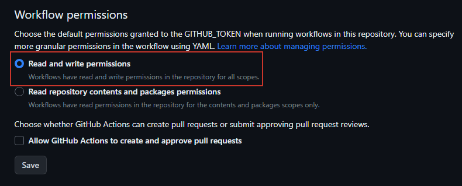

# Example-mdBook
This is a simple repostory that was made to teach myself (and anyone else) how to easily create a **Github Pages mdBook Workflow** utilizing custom domains.
  
- Live can be found here: https://example.hotbox.zip

## Creating your Site:

> [!IMPORTANT] Disclaimer
> This example is a manual walkthrough of setting up the Github Pages mdBook Workflow WITHOUT having to setup/use ``mdbook`` locally on your own system.
> - Steps 2 through 4 are normally done automatically by running ``mdbook init``.
> - Using custom domain names is NOT a requirement for setting up a successful Github Page, but I included it for completion and vebosity.


#### 1. Create a repository that is set to ``Public``


#### 2. Create a ``src`` directory.


#### 3. Place all Markdown files (aka the site contents) into the ``src`` directory.
- The root ``.md`` file should be ``SUMMARY.md``.
- Formatting documentation can be found [here](https://rust-lang.github.io/mdBook/format/summary.html).
- Example ``SUMMARY.md``:

```markdown
# Example mdBook

- [Table of Contents](./SUMMARY.md)
- [Primary Directory](Primary%20Directory/README.md)
  - [mdBook Github Pages Checklist](Primary%20Directory/mdBook_GithubPages_Checklist.md)
- [Secondary Directory](Secondary%20Directory/README.md)
  - [Obsidian Markdown Test](Secondary%20Directory/Obsidian_Markdown_Test.md)
- [Tertiary Directory](Tertiary%20Directory/README.md)
  - [Export-Obsidian.ps1](Tertiary%20Directory/Export-Obsidian.md)
```


#### 4. Include a simple ``book.toml``
- Your custom domain name should be included.
- If no domain name is specified, Github Pages will opt for: ``https://<username>.github.io/<repository>``
- Example ``book.toml``:

```toml
[book]
authors = ["Tyler McCann (@tylerdotrar)"]
language = "en"
multilingual = false
src = "src"
title = "Example mdBook"

[build]
build-dir = "public"

[output.html]
cname="example.hotbox.zip"
```


#### 5. Enable 'Read & Write Permissions' for Workflows using the GITHUB_TOKEN.
- ``Repository --> Settings --> Actions --> General --> Workflow Permissions``




#### 6. Create mdBook Workflow (``mdbook.yml``)
- ``Repository --> Actions --> Pages --> View All --> mdBook --> Configure``
- The default deployment yelled at me, so I opted for a simpler, custom ``mdbook.yml``.
- Example ``mdbook.yml``:

```yml
name: Deploy mdBook Github Pages

on:
  push:
    branches:
      - main
  pull_request:

jobs:
  deploy:
    runs-on: ubuntu-20.04
    concurrency:
      group: ${{ github.workflow }}-${{ github.ref }}
    steps:
      - uses: actions/checkout@v2

      - name: Setup mdBook
        uses: peaceiris/actions-mdbook@v1
        with:
          mdbook-version: '0.4.21'
          # mdbook-version: 'latest'

      - run: mdbook build

      - name: Deploy
        uses: peaceiris/actions-gh-pages@v3
        if: ${{ github.ref == 'refs/heads/main' }}
        with:
          github_token: ${{ secrets.GITHUB_TOKEN }}
          publish_dir: ./public
```

#### 7. Set your Github Page deployment to the 'gh-pages' branch.
- The 'gh-pages' branch will be created by the ``mdbook.yml`` workflow (assuming no errors occur).
- Once it is created, you can set that branch as your deployment branch.


#### 8. Create a CNAME record to point your custom domain to the Github Pages site.
- Documentation on configuring subdomains with Github Pages can be found [here](https://docs.github.com/en/pages/configuring-a-custom-domain-for-your-github-pages-site/managing-a-custom-domain-for-your-github-pages-site#configuring-an-apex-domain-and-the-www-subdomain-variant).
- This step will vary for everyone, so below is my experience with Cloudflare.


#### 9. Add your target Domain to your Repository settings.
- ``Repository --> Settings --> Pages --> Custom Domain``
- Once your CNAME finishes propegating, your mdBook should now be accessible.


#### 10. Flex on your peers.

